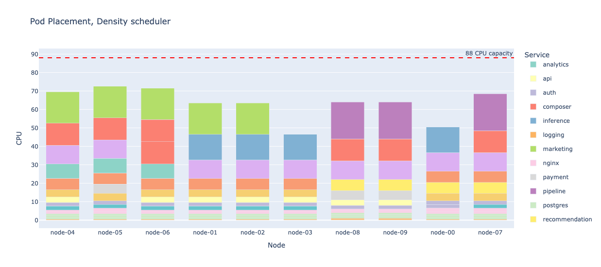
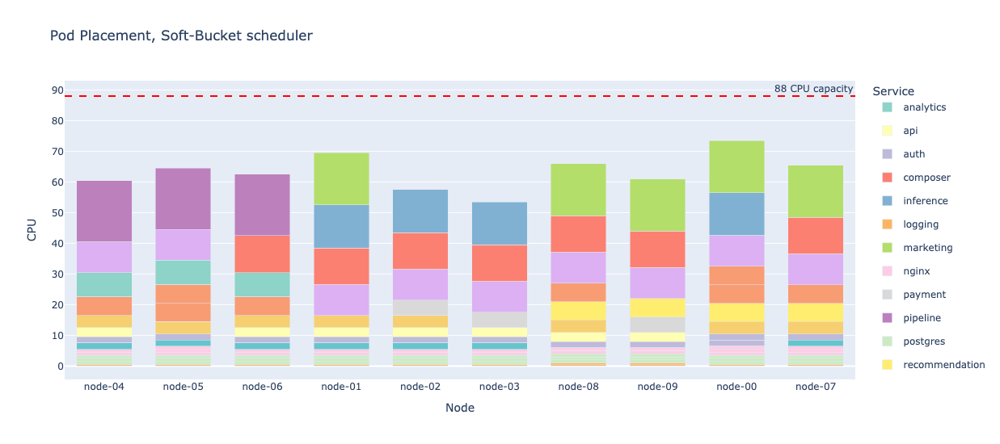
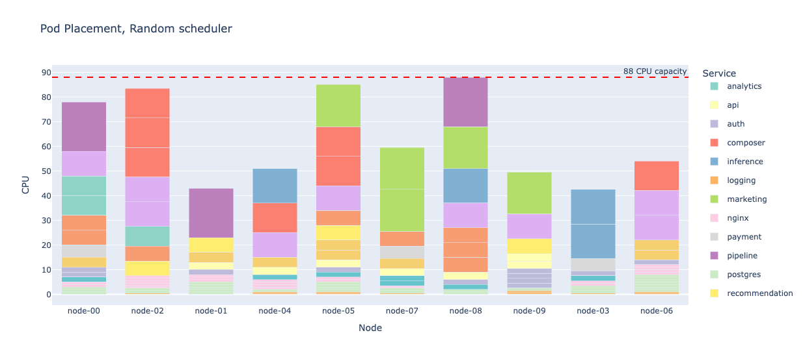

# K8s Pod-Size Scheduler

### Kernel density / similarity balancing

For incoming pod size $x$, define how much node $j$ already has pods of similar size:

$$
D_j(x) = \sum_{q \in node_j} K(x, x_q)
$$

where:

- $x_q$ is CPU request of existing pod $q$
- $K$ is a smooth similarity kernel, e.g. Gaussian:

$$
K(x, y) = \exp\left(-\frac{(x-y)^2}{2\sigma^2}\right)
$$

Interpretation:

- if node already has many pods near size $x$, $D_j(x)$ is large
- prefer nodes where $D_j(x)$ is smaller

Score:

$$
S_j = -D_j(x)
$$

This is the closest continuous version of "balance count of same-size pods across nodes".

Instead of rigid bins, every pod contributes partially to nearby sizes.

It behaves like soft buckets.

Instead of discrete class count:

$$
n_{j,k}
$$

use smooth "mass near x":

$$
D_j(x) = \sum_{q \in node_j} K(x, x_q)
$$

So there is a tradeoff:

- **Fixed buckets**: exact control, interpretable, but discontinuous
- **Continuous similarity**: smooth and elegant, but less explicit

A compromise is **soft buckets**.

Example anchor sizes:

- small center = 1 CPU
- mid center = 4 CPU
- large center = 10 CPU
- xl center = 18 CPU

Then every pod contributes to all classes with smooth weights:

$$
w_k(x) = \exp\left(-\frac{(x-\mu_k)^2}{2\sigma_k^2}\right)
$$

For each node:

$$
n^{soft}_{j,k} = \sum_{q \in node_j} w_k(x_q)
$$

Then for incoming pod of size $x$, score node by how much it worsens imbalance of these soft class counts.

This gives:

- class-like behavior
- smooth transitions
- still understandable to humans

May be better than either pure hard buckets or pure unrestricted continuous scoring.

A practical soft-bucket score would be:

$$
S_j = - \sum_k \alpha_k \cdot w_k(x) \cdot n^{soft}_{j,k}
$$

where:

- $n^{soft}_{j,k}$ is current soft mass of class $k$ on node $j$
- $w_k(x)$ is contribution of incoming pod to class $k$

### Demo: see [scheduler.ipynb](scripts/scheduler.ipynb) for a simulation of how this scoring methods distribute pods across nodes

#### Results

<table border="1">
  <thead>
    <tr style="text-align: right;">
      <th></th>
      <th>strategy</th>
      <th>cpu_std</th>
      <th>pod_count_std</th>
      <th>small_std</th>
      <th>mid_std</th>
      <th>large_std</th>
      <th>xl_std</th>
      <th>total_bucket_std</th>
    </tr>
  </thead>
  <tbody>
    <tr>
      <th>0</th>
      <td>Soft-Bucket</td>
      <td>5.47</td>
      <td>0.80</td>
      <td>0.38</td>
      <td>0.31</td>
      <td>0.16</td>
      <td>0.30</td>
      <td>1.14</td>
    </tr>
    <tr>
      <th>1</th>
      <td>Density</td>
      <td>8.15</td>
      <td>0.80</td>
      <td>0.38</td>
      <td>0.24</td>
      <td>0.46</td>
      <td>0.32</td>
      <td>1.39</td>
    </tr>
    <tr>
      <th>2</th>
      <td>Random</td>
      <td>17.30</td>
      <td>2.76</td>
      <td>2.52</td>
      <td>1.01</td>
      <td>1.49</td>
      <td>0.59</td>
      <td>5.60</td>
    </tr>
  </tbody>
</table>

#### Visualizations

**Density scheduler**: pure continuous similarity-based scoring

**Soft-buckets scheduler**: soft bucket scoring with 4 anchors

**Random scheduler**: random scoring for comparison

